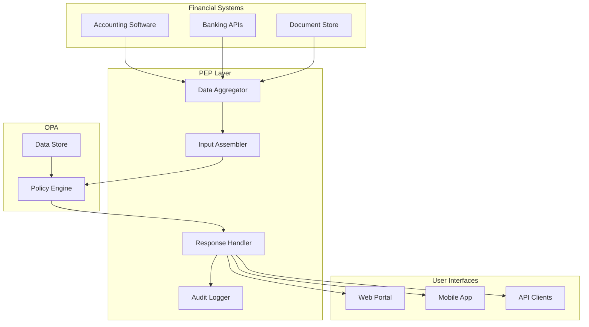

# Policy Enforcement Point (PEP) Implementation Guide
*Bridging the Gap Between OPA Policies and Financial Systems*

---

## Architecture Overview

The Policy Enforcement Point is the critical integration layer that:
1. Collects data from multiple sources
2. Assembles structured input for OPA
3. Handles graduated responses
4. Manages emergency overrides
5. Provides user-friendly feedback



---

## Core PEP Components

### 1. Data Aggregation Service

```typescript
// data-aggregator.ts
import { createHash } from 'crypto';
import { Cache } from './cache';
import { Lock } from './distributed-lock';

interface DataSource {
    name: string;
    type: 'accounts' | 'entities' | 'thresholds' | 'authorities';
    fetchFn: () => Promise<any>;
    ttlSeconds: number;
    requiresSignature: boolean;
}

export class DataAggregator {
    private sources: Map<string, DataSource> = new Map();
    private cache: Cache;
    private lock: Lock;
    
    constructor(cache: Cache, lock: Lock) {
        this.cache = cache;
        this.lock = lock;
        this.registerDataSources();
    }
    
    private registerDataSources() {
        // Register account data source
        this.sources.set('accounts', {
            name: 'accounts',
            type: 'accounts',
            fetchFn: async () => {
                // Fetch from accounting system
                const accounts = await this.fetchFromAccountingSystem();
                return this.addIntegrityMetadata(accounts);
            },
            ttlSeconds: 300, // 5 minutes
            requiresSignature: true
        });
        
        // Register entity configuration
        this.sources.set('entities', {
            name: 'entities',
            type: 'entities',
            fetchFn: async () => {
                // Fetch from configuration database
                const entities = await this.fetchFromConfigDB();
                return this.addIntegrityMetadata(entities);
            },
            ttlSeconds: 3600, // 1 hour
            requiresSignature: true
        });
        
        // Register threshold configuration
        this.sources.set('thresholds', {
            name: 'thresholds',
            type: 'thresholds',
            fetchFn: async () => {
                // Fetch from governance system
                const thresholds = await this.fetchFromGovernanceDB();
                return this.addIntegrityMetadata(thresholds);
            },
            ttlSeconds: 3600, // 1 hour
            requiresSignature: true
        });
    }
    
    async createConsistentSnapshot(requiredSources: string[]): Promise<DataSnapshot> {
        // Use distributed lock to ensure consistency
        return await this.lock.acquire('data-snapshot', async () => {
            const snapshot: DataSnapshot = {
                timestamp: Date.now(),
                sources: {},
                metadata: {}
            };
            
            // Fetch all required sources
            for (const sourceName of requiredSources) {
                const source = this.sources.get(sourceName);
                if (!source) {
                    throw new Error(`Unknown data source: ${sourceName}`);
                }
                
                // Try cache first
                let data = await this.cache.get(sourceName);
                
                if (!data || this.isStale(data, source.ttlSeconds)) {
                    // Fetch fresh data
                    data = await source.fetchFn();
                    await this.cache.set(sourceName, data, source.ttlSeconds);
                }
                
                // Verify signature if required
                if (source.requiresSignature) {
                    this.verifySignature(data);
                }
                
                snapshot.sources[sourceName] = data;
                
                // Add metadata for OPA
                snapshot.metadata[sourceName] = {
                    fetchedAt: data.timestamp,
                    hash: this.calculateHash(data),
                    signature: data.signature,
                    ttl: source.ttlSeconds
                };
            }
            
            return snapshot;
        });
    }
    
    private addIntegrityMetadata(data: any): any {
        const content = JSON.stringify(data);
        const hash = createHash('sha256').update(content).digest('hex');
        
        return {
            ...data,
            timestamp: Date.now(),
            hash: hash,
            signature: this.signData(content)
        };
    }
    
    private signData(content: string): Signature {
        // Sign with private key
        // Implementation depends on your PKI setup
        return {
            algorithm: 'RS256',
            keyId: 'data-signing-key-001',
            signature: '...',
            timestamp: Date.now()
        };
    }
    
    private verifySignature(data: any): boolean {
        // Verify with public key
        // Throws if invalid
        if (!this.isValidSignature(data.signature, data)) {
            throw new Error(`Invalid signature for data: ${data.hash}`);
        }
        return true;
    }
    
    private calculateHash(data: any): string {
        const content = JSON.stringify(data);
        return createHash('sha256').update(content).digest('hex');
    }
    
    private isStale(data: any, ttlSeconds: number): boolean {
        const ageMs = Date.now() - data.timestamp;
        return ageMs > (ttlSeconds * 1000);
    }
}
```

### 2. Input Assembly Service

```typescript
// input-assembler.ts
export class InputAssembler {
    constructor(
        private aggregator: DataAggregator,
        private calculator: CalculationService
    ) {}
    
    async assembleTransactionInput(
        transaction: Transaction,
        context: EvaluationContext
    ): Promise<OPAInput> {
        // Get required data sources based on transaction type
        const requiredSources = this.determineRequiredSources(transaction);
        
        // Create consistent snapshot
        const snapshot = await this.aggregator.createConsistentSnapshot(requiredSources);
        
        // Pre-calculate expensive aggregations
        const calculations = await this.calculator.calculate(transaction, snapshot);
        
        // Assemble OPA input
        const input: OPAInput = {
            // Evaluation context with fixed timestamp
            evaluation_context: {
                timestamp: Date.now(),
                request_id: context.requestId,
                user: {
                    id: context.user.id,
                    name: context.user.name,
                    roles: context.user.roles
                },
                session: {
                    id: context.session.id,
                    ip: context.session.ip,
                    started: context.session.started
                },
                system_version: process.env.SYSTEM_VERSION,
                environment: process.env.ENVIRONMENT // 'production', 'staging', etc.
            },
            
            // Transaction data
            transaction: this.normalizeTransaction(transaction),
            
            // Emergency override if present
            emergency_override: context.emergencyOverride || {
                active: false
            },
            
            // Data source metadata for verification
            data_sources_used: Object.entries(snapshot.metadata).map(([name, meta]) => ({
                name,
                timestamp: meta.fetchedAt,
                content_hash: meta.hash,
                signature: meta.signature
            })),
            
            // Pre-calculated values for efficiency
            calculated_values: {
                current_reserves: calculations.reserves,
                monthly_burn_rate: calculations.burnRate,
                pending_transactions_total: calculations.pendingTotal,
                days_since_last_reconciliation: calculations.reconciliationAge,
                risk_score: calculations.riskScore
            },
            
            // Include the actual data for OPA to use
            data: {
                accounts: snapshot.sources.accounts,
                entities: snapshot.sources.entities,
                thresholds: snapshot.sources.thresholds,
                authorities: snapshot.sources.authorities
            }
        };
        
        return input;
    }
    
    private determineRequiredSources(transaction: Transaction): string[] {
        const base = ['accounts', 'entities', 'thresholds'];
        
        // Add additional sources based on transaction type
        if (transaction.type === 'inter_entity_transfer') {
            base.push('authorities'); // For approval matrix
        }
        
        if (transaction.requiresGovernanceApproval) {
            base.push('governance_decisions');
        }
        
        return base;
    }
    
    private normalizeTransaction(transaction: Transaction): NormalizedTransaction {
        // Ensure consistent structure
        return {
            id: transaction.id || uuidv4(),
            date: transaction.date || new Date().toISOString(),
            entity: transaction.entity,
            type: transaction.type || 'standard',
            classification: this.classifyTransaction(transaction),
            amount: parseFloat(transaction.amount.toString()),
            currency: transaction.currency || 'USD',
            source_account: transaction.sourceAccount,
            destination_account: transaction.destinationAccount,
            destination_entity: transaction.destinationEntity || transaction.entity,
            
            line_items: transaction.lineItems?.map(item => ({
                description: item.description,
                amount: parseFloat(item.amount.toString()),
                category: item.category,
                tax_treatment: item.taxTreatment
            })) || [],
            
            supporting_documents: transaction.documents?.map(doc => ({
                type: doc.type,
                url: doc.url,
                hash: doc.hash,
                uploaded_at: doc.uploadedAt
            })) || [],
            
            metadata: {
                ...transaction.metadata,
                normalized_at: Date.now()
            }
        };
    }
    
    private classifyTransaction(transaction: Transaction): string {
        // Classify for policy evaluation
        if (transaction.tags?.includes('payroll')) return 'critical';
        if (transaction.tags?.includes('tax')) return 'critical';
        if (transaction.amount > 50000) return 'high_value';
        if (transaction.type === 'investment') return 'investment';
        return 'standard';
    }
}
```

### 3. Response Handler

```typescript
// response-handler.ts
export class ResponseHandler {
    constructor(
        private notificationService: NotificationService,
        private auditLogger: AuditLogger,
        private userMessageFormatter: UserMessageFormatter
    ) {}
    
    async handleOPAResponse(
        decision: OPADecision,
        transaction: Transaction,
        context: EvaluationContext
    ): Promise<ProcessedResponse> {
        // Parse the OPA response
        const parsed = this.parseDecision(decision);
        
        // Build base response
        const response: ProcessedResponse = {
            allowed: parsed.allow,
            transactionId: transaction.id,
            decisionId: decision.decision_id,
            timestamp: Date.now(),
            severity: parsed.severity || 'INFO'
        };
        
        // Handle different severity levels
        switch (response.severity) {
            case 'INFO':
                // Transaction allowed, no special handling
                response.status = 'approved';
                break;
                
            case 'WARN':
                // Transaction allowed but with warnings
                response.status = 'approved_with_warnings';
                response.warnings = parsed.warnings;
                await this.handleWarnings(parsed.warnings, transaction, context);
                break;
                
            case 'ALERT':
                // Requires additional approval
                response.status = 'pending_approval';
                response.requiredApprovals = parsed.requiredApprovals;
                await this.initiateApprovalWorkflow(transaction, parsed.requiredApprovals);
                break;
                
            case 'CRITICAL':
                // Transaction denied unless override
                response.status = 'denied';
                response.denialReasons = parsed.denialReasons;
                response.overrideAvailable = parsed.overrideAvailable;
                
                if (parsed.overrideAvailable) {
                    response.overrideInstructions = this.getOverrideInstructions();
                }
                break;
                
            case 'LOCKDOWN':
                // System integrity failure
                response.status = 'system_lockdown';
                await this.handleLockdown(parsed, context);
                break;
        }
        
        // Format user-friendly messages
        response.userMessage = this.userMessageFormatter.format(response);
        
        // Create audit log entry
        await this.createAuditLog(decision, response, transaction, context);
        
        // Send notifications if needed
        await this.sendNotifications(response, context);
        
        return response;
    }
    
    private async handleWarnings(
        warnings: PolicyWarning[],
        transaction: Transaction,
        context: EvaluationContext
    ): Promise<void> {
        // Log warnings
        for (const warning of warnings) {
            await this.auditLogger.logWarning({
                code: warning.code,
                message: warning.message,
                transactionId: transaction.id,
                userId: context.user.id,
                timestamp: Date.now()
            });
        }
        
        // Send warning notifications
        if (warnings.some(w => w.code === 'RESERVE_WARNING')) {
            await this.notificationService.notifyFinanceTeam({
                type: 'RESERVE_WARNING',
                transaction: transaction,
                warnings: warnings
            });
        }
    }
    
    private async initiateApprovalWorkflow(
        transaction: Transaction,
        requiredApprovals: ApprovalRequirement[]
    ): Promise<void> {
        // Create approval request
        const approvalRequest = {
            id: uuidv4(),
            transactionId: transaction.id,
            requiredApprovals: requiredApprovals,
            created: Date.now(),
            expires: Date.now() + (24 * 60 * 60 * 1000), // 24 hours
            status: 'pending'
        };
        
        // Store in approval queue
        await this.storeApprovalRequest(approvalRequest);
        
        // Notify approvers
        for (const requirement of requiredApprovals) {
            await this.notificationService.notifyApprovers({
                approvalRequestId: approvalRequest.id,
                transaction: transaction,
                requirement: requirement,
                urgency: this.calculateUrgency(transaction)
            });
        }
    }
    
    private async handleLockdown(
        parsed: ParsedDecision,
        context: EvaluationContext
    ): Promise<void> {
        // Critical system failure - escalate immediately
        await this.notificationService.sendCriticalAlert({
            type: 'SYSTEM_LOCKDOWN',
            violations: parsed.violations,
            context: context,
            timestamp: Date.now()
        });
        
        // Log incident
        await this.auditLogger.logIncident({
            severity: 'CRITICAL',
            type: 'SYSTEM_INTEGRITY_FAILURE',
            details: parsed.violations,
            userId: context.user.id,
            timestamp: Date.now()
        });
        
        // Initiate incident response
        await this.initiateIncidentResponse(parsed.violations);
    }
    
    private async createAuditLog(
        decision: OPADecision,
        response: ProcessedResponse,
        transaction: Transaction,
        context: EvaluationContext
    ): Promise<void> {
        const auditEntry = {
            id: uuidv4(),
            timestamp: Date.now(),
            decision: {
                id: decision.decision_id,
                result: decision.result,
                policies_evaluated: decision.metrics?.policies_evaluated || [],
                evaluation_time_ms: decision.metrics?.evaluation_time_ms || 0
            },
            transaction: {
                id: transaction.id,
                amount: transaction.amount,
                type: transaction.type,
                entity: transaction.entity
            },
            context: {
                user: context.user.id,
                session: context.session.id,
                ip: context.session.ip
            },
            response: {
                status: response.status,
                severity: response.severity,
                warnings: response.warnings?.length || 0,
                denials: response.denialReasons?.length || 0
            },
            signature: await this.signAuditEntry(auditEntry)
        };
        
        await this.auditLogger.log(auditEntry);
    }
}
```

### 4. Emergency Override Handler

```typescript
// emergency-override.ts
export class EmergencyOverrideHandler {
    constructor(
        private authService: AuthenticationService,
        private auditLogger: AuditLogger,
        private notificationService: NotificationService
    ) {}
    
    async requestOverride(
        transaction: Transaction,
        justification: string,
        requestor: User
    ): Promise<OverrideRequest> {
        // Validate requestor can initiate override
        if (!this.canRequestOverride(requestor)) {
            throw new Error('User not authorized to request emergency override');
        }
        
        // Create override request
        const request: OverrideRequest = {
            id: uuidv4(),
            transactionId: transaction.id,
            requestor: {
                id: requestor.id,
                name: requestor.name,
                role: requestor.role
            },
            justification: justification,
            created: Date.now(),
            expires: Date.now() + (4 * 60 * 60 * 1000), // 4 hours max
            status: 'pending_approval',
            approvals: [],
            requiredApprovals: 2 // Configurable
        };
        
        // Store request
        await this.storeOverrideRequest(request);
        
        // Notify emergency approvers
        await this.notifyEmergencyApprovers(request, transaction);
        
        // Log override request
        await this.auditLogger.logOverrideRequest({
            request: request,
            transaction: transaction,
            timestamp: Date.now()
        });
        
        return request;
    }
    
    async approveOverride(
        requestId: string,
        approver: User,
        comments: string
    ): Promise<OverrideApproval> {
        // Verify approver authorization
        if (!await this.isEmergencyApprover(approver)) {
            throw new Error('User not authorized as emergency approver');
        }
        
        // Get request
        const request = await this.getOverrideRequest(requestId);
        
        // Check if already approved by this user
        if (request.approvals.some(a => a.approver.id === approver.id)) {
            throw new Error('Already approved by this user');
        }
        
        // Create approval
        const approval: OverrideApproval = {
            approver: {
                id: approver.id,
                name: approver.name,
                role: approver.role
            },
            timestamp: Date.now(),
            comments: comments,
            signature: await this.signApproval(approver, requestId)
        };
        
        // Add approval to request
        request.approvals.push(approval);
        
        // Check if we have enough approvals
        if (request.approvals.length >= request.requiredApprovals) {
            request.status = 'approved';
            
            // Generate override token
            const token = await this.generateOverrideToken(request);
            
            // Notify requestor
            await this.notificationService.notifyOverrideApproved({
                request: request,
                token: token
            });
            
            // Set auto-revoke timer
            this.scheduleOverrideRevocation(request.id, request.expires);
        }
        
        // Update request
        await this.updateOverrideRequest(request);
        
        // Log approval
        await this.auditLogger.logOverrideApproval({
            requestId: requestId,
            approval: approval,
            status: request.status,
            timestamp: Date.now()
        });
        
        return approval;
    }
    
    async useOverride(
        token: string,
        transaction: Transaction
    ): Promise<EmergencyOverride> {
        // Validate token
        const request = await this.validateOverrideToken(token);
        
        if (request.status !== 'approved') {
            throw new Error('Override not approved');
        }
        
        if (Date.now() > request.expires) {
            throw new Error('Override expired');
        }
        
        if (request.transactionId !== transaction.id) {
            throw new Error('Override token not valid for this transaction');
        }
        
        // Create override object for OPA
        const override: EmergencyOverride = {
            active: true,
            requestId: request.id,
            justification: request.justification,
            approvers: request.approvals.map(a => ({
                id: a.approver.id,
                signature_valid: true,
                timestamp: a.timestamp.toString()
            })),
            expiry: new Date(request.expires).toISOString()
        };
        
        // Log override usage
        await this.auditLogger.logOverrideUsage({
            override: override,
            transaction: transaction,
            timestamp: Date.now()
        });
        
        return override;
    }
    
    private async generateOverrideToken(request: OverrideRequest): Promise<string> {
        // Generate secure, signed token
        const payload = {
            requestId: request.id,
            transactionId: request.transactionId,
            expires: request.expires,
            approvals: request.approvals.map(a => a.approver.id)
        };
        
        return await this.authService.signToken(payload, {
            expiresIn: request.expires - Date.now()
        });
    }
    
    private scheduleOverrideRevocation(requestId: string, expires: number): void {
        const delay = expires - Date.now();
        
        setTimeout(async () => {
            await this.revokeOverride(requestId);
        }, delay);
    }
}
```

---

## Integration Examples

### QuickBooks Integration

```typescript
// integrations/quickbooks.ts
export class QuickBooksIntegration {
    private pep: PolicyEnforcementPoint;
    
    async beforeTransactionSave(transaction: QBTransaction): Promise<void> {
        // Convert QB transaction to standard format
        const standardTx = this.convertToStandardTransaction(transaction);
        
        // Evaluate with OPA
        const decision = await this.pep.evaluateTransaction(standardTx, {
            user: this.getCurrentUser(),
            session: this.getSession()
        });
        
        if (!decision.allowed) {
            // Prevent save in QuickBooks
            throw new QuickBooksError({
                code: 'POLICY_VIOLATION',
                message: decision.userMessage,
                details: decision.denialReasons
            });
        }
        
        if (decision.warnings) {
            // Show warnings in QuickBooks UI
            this.showWarnings(decision.warnings);
        }
    }
}
```

### Terraform Integration

```hcl
# terraform/policy-check.tf
data "external" "policy_check" {
  program = ["${path.module}/scripts/opa-check.sh"]
  
  query = {
    action     = "terraform_apply"
    entity     = var.entity_name
    estimated_cost = var.estimated_monthly_cost
    resources  = jsonencode(var.resource_list)
  }
}

resource "null_resource" "policy_gate" {
  # Block if policy check fails
  count = data.external.policy_check.result.allowed ? 1 : 0
  
  provisioner "local-exec" {
    command = "echo 'Policy check passed'"
  }
}
```

---

## Monitoring & Observability

### Key Metrics to Track

```yaml
# prometheus-metrics.yaml
metrics:
  # Policy evaluation metrics
  - name: opa_evaluations_total
    type: counter
    labels: [entity, transaction_type, result]
    
  - name: opa_evaluation_duration_seconds
    type: histogram
    labels: [entity, transaction_type]
    
  - name: opa_denials_total
    type: counter
    labels: [entity, denial_code]
    
  # Override metrics
  - name: emergency_overrides_total
    type: counter
    labels: [entity, justification_category]
    
  - name: override_approval_time_seconds
    type: histogram
    labels: [entity]
    
  # Data freshness metrics
  - name: data_source_age_seconds
    type: gauge
    labels: [source_name]
    
  - name: data_validation_failures_total
    type: counter
    labels: [source_name, failure_type]
    
  # System health metrics
  - name: pep_availability
    type: gauge
    labels: [component]
    
  - name: audit_log_lag_seconds
    type: gauge
    labels: []
```

### Alerting Rules

```yaml
# alerts.yaml
groups:
  - name: policy_alerts
    rules:
      - alert: HighDenialRate
        expr: rate(opa_denials_total[5m]) > 0.1
        for: 10m
        annotations:
          summary: "High transaction denial rate"
          description: "{{ $value }} denials per second"
          
      - alert: FrequentOverrides
        expr: rate(emergency_overrides_total[1h]) > 3
        for: 30m
        annotations:
          summary: "Frequent emergency overrides"
          description: "{{ $value }} overrides in the last hour"
          
      - alert: StaleData
        expr: data_source_age_seconds > 3600
        for: 5m
        annotations:
          summary: "Data source is stale"
          description: "{{ $labels.source_name }} is {{ $value }} seconds old"
          
      - alert: PolicyEvaluationSlow
        expr: histogram_quantile(0.95, opa_evaluation_duration_seconds) > 0.5
        for: 10m
        annotations:
          summary: "Policy evaluation is slow"
          description: "95th percentile latency is {{ $value }} seconds"
```

---

## Training & Documentation

### User Training Materials

1. **Quick Reference Card**
   - Common denial codes and what they mean
   - How to request an override
   - Who to contact for help

2. **Video Tutorials**
   - "Understanding Policy Denials"
   - "Emergency Override Process"
   - "Reconciliation Requirements"

3. **Runbooks**
   - Month-end closing procedures
   - Handling payroll with policy checks
   - Inter-entity transfer documentation

### Administrator Documentation

1. **System Architecture**
   - Component diagrams
   - Data flow documentation
   - Security model

2. **Operational Procedures**
   - Policy update process
   - Emergency response plan
   - Backup and recovery

3. **Troubleshooting Guide**
   - Common issues and solutions
   - Performance tuning
   - Debug logging

---

## Rollout Checklist

### Pre-Launch (2 weeks before)
- [ ] PKI infrastructure deployed
- [ ] Test environment operational
- [ ] Integration points identified
- [ ] Training materials prepared
- [ ] Emergency approvers designated
- [ ] Runbooks written

### Launch Week
- [ ] Shadow mode activated
- [ ] Metrics collection started
- [ ] Daily review meetings scheduled
- [ ] Support channel established
- [ ] Feedback mechanism in place

### Post-Launch (First Month)
- [ ] Daily metrics review
- [ ] Weekly stakeholder updates
- [ ] Threshold tuning based on data
- [ ] User feedback incorporation
- [ ] Documentation updates

---

This implementation guide provides the practical bridge between your OPA policies and real-world financial systems, addressing the key concerns raised in the critiques while maintaining the integrity of your Charter principles.
